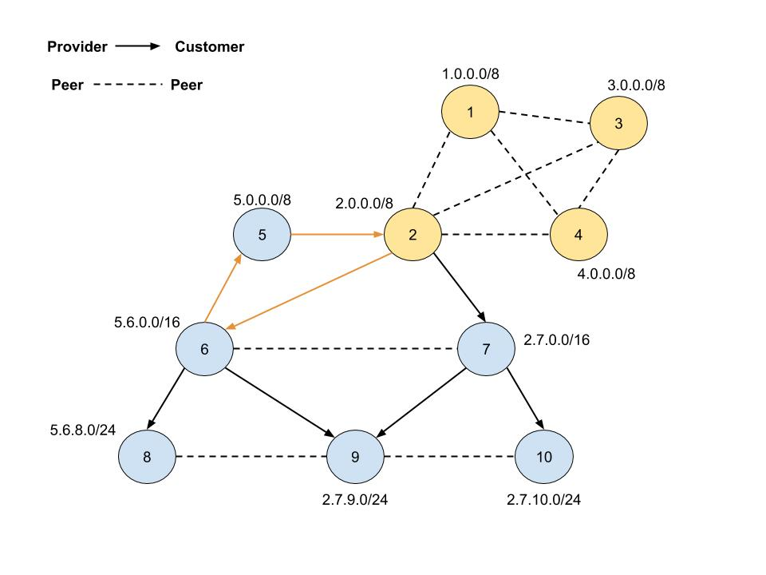

# ROVpp Simulation DB

This is used to make small tests of the extrapolator at this point.
The default topology when building the image is the following:



## How to run using docker


#### Get DB from Docker

```
docker pull ireynaldo/forecastdb
```

#### Run container

Using the following command, you will be able to access the database running on port `5566` on your machine.

```
docker run -p 5566:5432 --name forecastedb ireynaldo/forecastdb
```

## Load/Change (small test topology)

```
docker exec -it database_db_1 change_topology small_test
```

## Load/Change caida

> **Note**: You need to download the CAIDA topology first which can be done by running `create_relationship_csv.sh` inside `topologies/caida`.

```
docker exec -it database_db_1 change_topology caida
```

##### If you want persistant container storage

If you want to keep data after it's stopped you need to use volumes.

```
docker run -p 5566:5432 -v <some_local_directory>:/var/lib/postgresql/data/pgdata --name forecastedb ireynaldo/forecastdb
```

##### Delete volume

List volumes
```
docker volume ls
```

Delete specific volume
```
docker volume rm <volume_name>
```

Removes any volume not being used
```
docker volume prune
```

#### How to stop container

```
docker stop forecastedb
```

#### How to start a `stopped` container

```
docker start forecastedb
```

#### How to remove container

```
docker rm forecastedb
```

#### How to remove image

```
docker rmi ireynaldo/forecastedb
```
