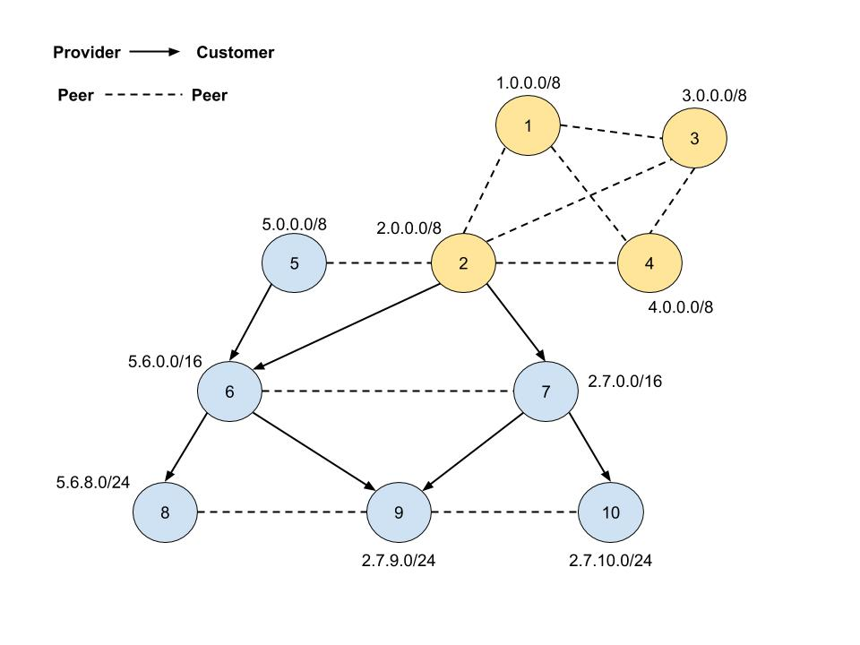

# ROVpp Simulation DB

This is used to make small tests of the extrapolator at this point.
The default topology when building the image is the following:



## How to run using docker


#### Get DB from Docker

```
docker pull ireynaldo/forecastdb
```

#### Run container

Using the following command, you will be able to access the database running on port `5566` on your machine.

```
docker run -p 5566:5432 --name forecastedb ireynaldo/forecastdb
```

#### How to stop container

```
docker stop forecastedb
```

#### How to start a `stopped` container

```
docker start forecastedb
```

#### How to remove container

```
docker rm forecastedb
```

#### How to remove image

```
docker rmi ireynaldo/forecastedb
```
